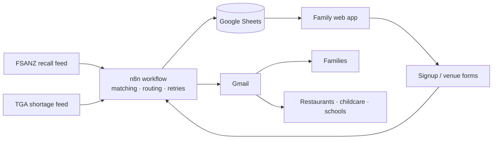

# AllerGreat

**Allergy alerts that are actually yours.**

AllerGreat watches official Australian food recall and medicine shortage feeds, and emails a person only when something involves their own allergies or medicines. Families can also send a clear allergy briefing to a restaurant, childcare centre or school in a few taps.

Built over one weekend at the **StartUp Link USYD n8n University Hackathon (September 2026)**, where it placed in the **top 8 of 39 teams** (150+ participants). Track 1: Best Overall / End-to-End Integration.

---

## The problem

Around **1.8 million Australians** report having a food allergy [1], and Australia has some of the highest rates of childhood food allergy in the world [2]. Undeclared allergens were the leading cause of Australian food recalls in 2025, and accounted for an average of **45.8% of recalls each year from 2021 to 2025** [3].

People living with food allergies carry a constant admin load:

- **Recalls are easy to miss.** The government publishes every recall — metal fragments, listeria, mould and allergens that aren't yours. Subscribe to all of it and you stop reading. *Subscribing to every recall is the same as ignoring every recall.*
- **The same email, over and over.** Parents re-explain their children's allergies to every restaurant, childcare centre and school, usually from memory.
- **Autoinjectors expire quietly.** An EpiPen lasts 12–18 months, and people find out it's out of date at the worst possible moment.

When we checked the ten most recent Australian food recalls during the hackathon, seven were caused by an allergen missing from the label.

## What it does

| Feature | How it works |
|---|---|
| **Personal recall alerts** | Reads the FSANZ recall feed every hour, works out which allergen caused each recall, and emails only the people it affects. Anaphylaxis, severe and mild reactions each get a different email. |
| **Medicine shortage alerts** | Reads the TGA shortage feed daily. Someone who carries an EpiPen hears about an adrenaline autoinjector shortage under any brand. |
| **Autoinjector expiry reminders** | Reminds at 90, 60, 30 and 7 days before expiry, and once on the day. Never daily. |
| **Venue briefings** | A parent picks who is going and where. AllerGreat writes a structured allergy email to the venue, sends the parent a copy, and replies go straight to the parent. |
| **Family app** | One place to save each family member, see which recalls affect whom, check expiry dates and send briefings. |
| **Self-monitoring** | A daily watchdog raises an incident if the recall monitor has processed nothing for 48 hours. For a safety system, silence is the dangerous failure. |

Every alert quotes the official notice and links to the source. AllerGreat never describes a product or venue as "safe".

## How it works

The automation is a single n8n workflow with **95 nodes in 8 sections**:

| # | Section | Trigger | Summary |
|---|---|---|---|
| 1 | Signup | Form | Validates the profile, normalises allergen names, stores it, sends a confirmation |
| 2 | Recall monitor | Hourly + manual | Fetch → extract allergens → skip already-processed → match → route by severity → email → log |
| 3 | Watchdog | Daily | Alerts the operator if the monitor has gone quiet for 48 hours |
| 4 | Unsubscribe | Form | Records opt-outs, which every other section checks before sending |
| 5 | Restaurant directory | Form | Restaurants self-declare the allergens their kitchen can accommodate |
| 6 | Medicine shortages | Daily | Same pipeline as recalls, pointed at the TGA |
| 7 | Injector expiry | Daily | Sends reminders only at meaningful distances from the expiry date |
| 8 | Venue enquiries | Form (from the app) | Builds the briefing email, honours venue opt-outs, logs every send |

### Design decisions

- **No AI model in the pipeline.** Recall notices follow a fixed structure (*Problem / Food safety hazard / What to do*), so deterministic matching is more accurate, costs nothing and can't fail during a live demo.
- **Hidden allergen names are handled.** Casein, whey and lactose map to milk; arachis to peanut; semolina and spelt to wheat/gluten. Word boundaries stop "veggie" matching "egg".
- **One vocabulary everywhere.** Signup, extraction, restaurants and the app all use the same 11 allergens, so a registered user can never silently fall out of matching.
- **No duplicate alerts.** Each recall is recorded by its ID and never alerted twice.
- **Every failure path is wired.** Feed requests retry three times, then log and email the operator. Failed emails, rejected signups and blocked enquiries are all recorded.
- **Newest profile wins.** Submitting the form again updates a person's allergies instead of creating a second set of alerts.

## Tech stack

- **n8n Cloud** — workflow, schedules, forms, retries and error branches
- **FSANZ and TGA RSS feeds** — official, public, live data
- **Google Sheets** — datastore for the pilot, chosen so every record is visible and auditable
- **Gmail** — alert and briefing delivery
- **HTML, CSS and vanilla JavaScript** — a single-file web app with no build step
- **Cloudflare** — hosting

## Repository contents

| File | Purpose |
|---|---|
| `index.html` | The web app (home page) |
| `app.html` | The same app, kept so older `/app` links still work |
| `n8n/allergreat-workflow.json` | The complete n8n workflow, with account details replaced by placeholders |
| `README.md` | This file |

## Running it yourself

**Web app** — open `index.html` in a browser, or deploy the folder to any static host. There is no build step.

**Automation**

1. In n8n, import `n8n/allergreat-workflow.json`.
2. Create a Google Sheet with the tabs `users`, `processed_recalls`, `sent_log`, `system_log`, `unsubscribes` and `restaurants`.
3. Replace `YOUR_GOOGLE_SHEET_ID` with your sheet's ID, and `operator@example.com` with the address that should receive failure alerts.
4. Open each Google Sheets and Gmail node and select your own credentials.
5. Publish the workflow so the form URLs go live.
6. In the web app, replace the n8n base URL and the sheet ID with your own.

The hosted pilot's backend ran on an n8n Cloud trial for the hackathon and is no longer live. A demo video shows the full flow.

## Testing

- 39 logic tests run against the live FSANZ and TGA feeds (allergen extraction, matching, duplicates, expiry rules)
- Live end-to-end runs through the real forms, inbox and sheet, including blocked venues and rejected enquiries
- Browser tests of the app on mobile and desktop, including malicious input, offline data and a failing automation

Bugs found and fixed during the hackathon included duplicate medicine alerts, a delivery log that recorded only one row per run, and a spreadsheet formula-injection risk in public forms.

## Limitations

This is a hackathon pilot, not a production service.

- **Accounts:** sign-in is name and email only, and family profiles are stored on the user's device. Verified accounts are the next step.
- **Storage:** Google Sheets is not suitable for health information at scale. Production would move to a secured database with access controls.
- **Abuse:** the venue enquiry endpoint needs verified accounts and rate limiting before a public launch.
- **Restaurants:** listings are self-declared and not verified. The directory is hidden in the app until venues sign up.
- **Medical advice:** AllerGreat is an alerting service. It does not replace reading the label, asking staff or medical advice.

## Roadmap

- Verified accounts that sync across devices
- A response form inside each venue email, with the venue's time-stamped reply saved in the app as a record
- A shared, de-identified database of venues that have confirmed which allergy profiles they can accommodate
- A morning reminder to the restaurant on the day of a booking
- Verified-owner restaurant partners and bookings
- Push notifications
- Schools and childcare centres managing their own rooms of children

## Team

| Name | Role |
|---|---|
| Jaehyeok Park | Original idea, n8n automation, web app, testing and deployment |
| Zac Stritch-Hoddle | Research, product direction and pitch |

## Disclaimer

AllerGreat is not medical advice. Alerts come from official Australian government data. If you are having an allergic reaction, use your adrenaline autoinjector and call **000**.

## Sources

1. Australian Bureau of Statistics (2025). [*Dieting and Food Avoidance, 2023*](https://www.abs.gov.au/statistics/health/food-and-nutrition/dieting-and-food-avoidance/2023). Released 5 September 2025.
2. Murdoch Children's Research Institute. [*Population Allergy*](https://www.mcri.edu.au/research/research-areas/population-health/population-allergy). Accessed 15 September 2026.
3. Food Standards Australia New Zealand (2026). [*Australian Food Recall Statistics*](https://www.foodstandards.gov.au/food-recalls/recallstats).
